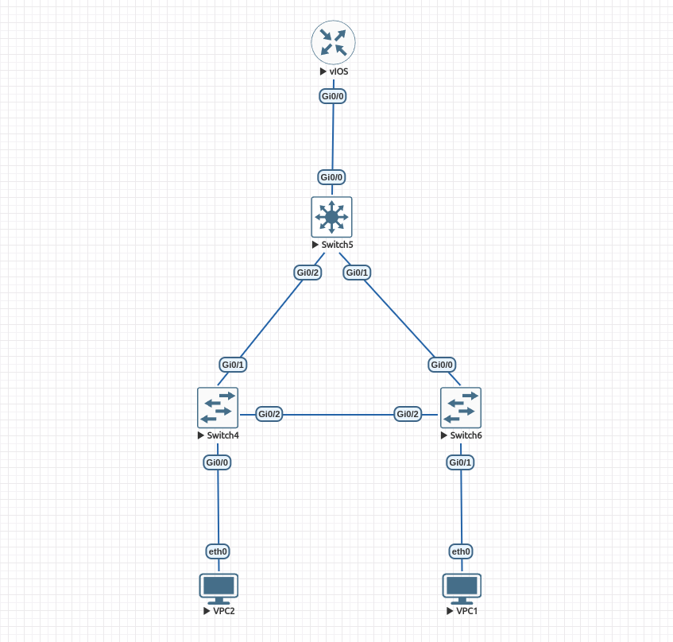
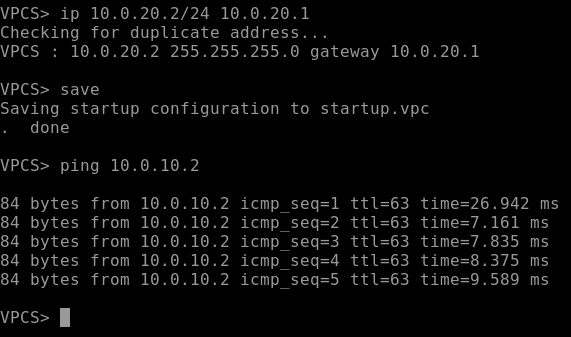
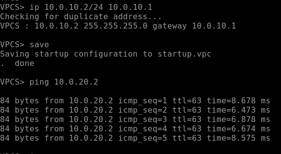
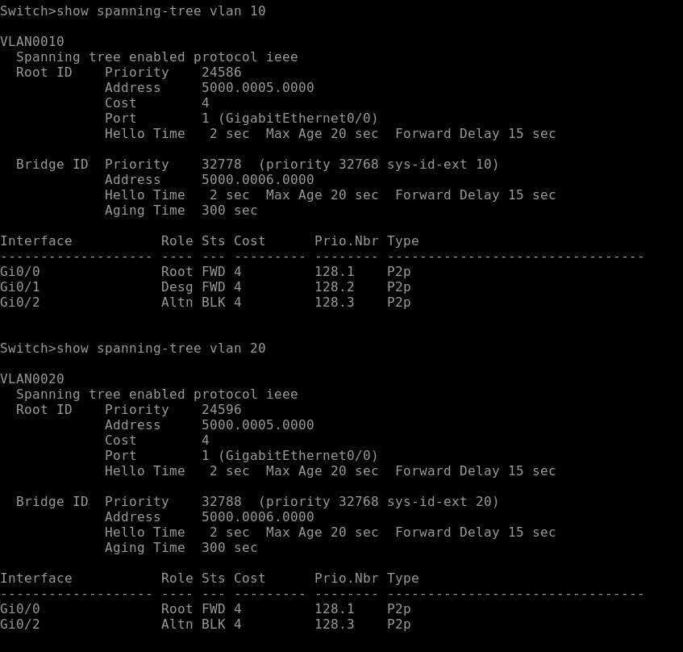

# Дз 1
## Сеть в eve-ng

## Порядок запуска команд на узлах


1. vpc1
```
ip 10.0.10.2/24 10.0.10.1
save
vpc2
ip 10.0.20.2/24 10.0.20.1
save
```

2. switch6 (near vpc1)
```
enable
config terminal
vlan 10
end
config terminal
vlan 20
end

config terminal
interface gi0/0
switchport trunk encapsulation dot1q
switchport mode trunk
end

config terminal
interface gi0/1
switchport mode access
switchport access vlan 10
end

config terminal
interface gi0/2
switchport trunk encapsulation dot1q
switchport mode trunk
end

write mem
```

3. switch4 (near vpc2)
```
enable
config terminal
vlan 10
end
config terminal
vlan 20
end

config terminal
interface gi0/0
switchport mode access
switchport access vlan 20
end

config terminal
interface gi0/1
switchport trunk encapsulation dot1q
switchport mode trunk
end

config terminal
interface gi0/2
switchport trunk encapsulation dot1q
switchport mode trunk
end

write mem
```

4. switch5 (root)
```
enable
config terminal
vlan 10
end
config terminal
vlan 20
end

config terminal
interface gi0/0
switchport trunk encapsulation dot1q
switchport mode trunk
end

config terminal
interface gi0/1
switchport trunk encapsulation dot1q
switchport mode trunk
end

config terminal
interface gi0/2
switchport trunk encapsulation dot1q
switchport mode trunk
end

config terminal
spanning-tree vlan 10 root primary
spanning-tree vlan 20 root primary
end

write mem
```

5. switch4, switch5
```
enable
configure terminal
spanning-tree mode pvst
end
write mem
```

6. vIOS
```
skip initial configuration dialog
enable
configure terminal

interface gi0/0
no shutdown
end

interface gi0/0.1
encapsulation dor1q 10
ip address 10.0.10.1 255.255.255.0
end

interface gi0/0.2
encapsulation dor1q 20
ip address 10.0.20.1 255.255.255.0
end

write mem
```
## Рабочий пинг



## Заблокированный линк


## Экспортированные конфиги
Лежат в директории configs